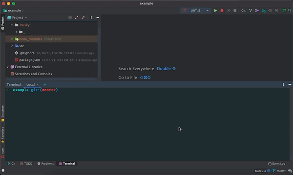
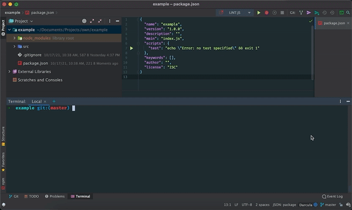
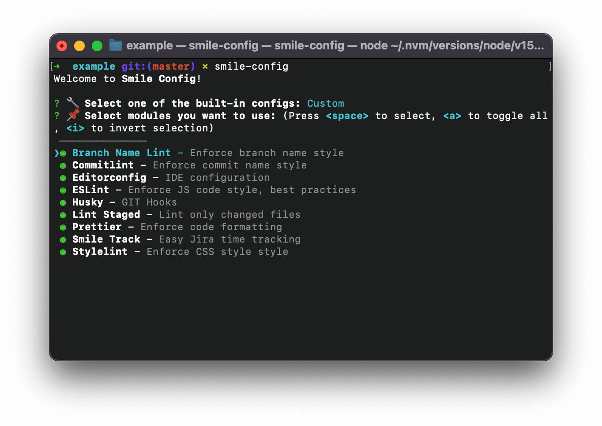

# Smile Config

A tool for cloning and templating code with configuration easily.
It features sharable configs for any template, such as linters, file structure, and config files.

```shell
npx smile-config
```



## Table of Contents

1) [Table of Contents](#table-of-contents)
1) [Goal and Philosophy](#goal-and-philosophy)
1) [Quickstart](#quickstart)
1) [Custom select](#custom-select)
1) [Built-in configs](#built-in-configs)
    - [Default](#default)
1) [Build your config](#build-your-config)
1) [TODO](#todo)
1) [License](#license)

## Goal and Philosophy

Well configured projects allow a team to work effectively and fast.
Some organizations have their configs and reuse them on different projects.
Suddenly, the setup of each tool requires time, and often this step is skipped, which leads to worse and magic code.

`Smile-Config` allows you to save this config and files to a sharable module.
You can apply this module to any project in few steps.
`Smile-Config` will install all needed dependencies and copy files, so you don't need to waste time configuring your tools each time.

It features Node.js best practices techniques in the default config, so you can start using it immediately.

Additionally, you can manually select which modules you want to use in your project, so it's flexible.
Each module can include different configs, such as for frontend, backend, frameworks, and others.
Thus, you can build a pure and complex module as well.

## Quickstart

1. Install [Node.js](https://nodejs.org/en/)
2. Install the package globally:

```shell script
$ npm install smile-config -g
```

Or use it immediately:

 ```shell script
$ npx smile-config
```

That's it! Now you can use the app in any folder.

## Custom select

Built-in and your configs support custom module selecting, so you can choose your setup.



## Built-in configs

### Default

Built-in default config has:
* [**Branch Name Lint**](https://www.npmjs.com/package/branch-name-lint) - Validating and linting the git branch name;
* [**CommitLint**](https://www.npmjs.com/package/@commitlint/cli) - Lint commit messages;
* [**EditorConfig**](https://editorconfig.org) - EditorConfig helps maintain consistent coding styles for multiple developers working on the same project across various editors and IDEs;
* [**ESLint**](https://www.npmjs.com/package/eslint) with addons: [TypeScript](https://www.npmjs.com/package/@typescript-eslint/eslint-plugin), [TSLint ordered-imports](https://www.npmjs.com/package/@typescript-eslint/eslint-plugin-tslint), SmileStyle;
* [**StyleLint**](https://www.npmjs.com/package/stylelint) - A mighty, modern linter that helps you avoid errors and enforce conventions in your styles;
* [**Prettier**](https://www.npmjs.com/package/prettier) with addons: [ESLint](https://www.npmjs.com/package/eslint-plugin-prettier) and [StyleLint](https://www.npmjs.com/package/stylelint-config-prettier) support;
* [**Husky**](https://www.npmjs.com/package/husky) with git hooks: precommit, prepush, commit-msg;
* [**Lint Staged**](https://www.npmjs.com/package/lint-staged) - Run linters against staged git files and don't let 💩 slip into your code base!;
* [**Smile Track**](https://www.npmjs.com/package/smile-track) -  is an app for auto calculating and tracking time by using your git history;
* [**VSCode suggested extensions**](https://code.visualstudio.com/docs/editor/extension-marketplace#_workspace-recommended-extensions) - A good set of extensions can make working with a particular workspace or programming language more productive and you'd often like to share this list with your team or colleagues.



## Build your config

> Note: API will be changed in the future

1) Fork the repo;
2) Create your own config. Use [default]() as an example;
3) Create pull request.

## TODO

* [ ] Add more configs
* [ ] Expose API for building your configs
* [ ] Support NPM packages as configs
* [ ] Support GIT repos as configs

## License

Created with ❤ by Dmytro Vakulenko, 2021.
